# Airbnb-DC-analysis

A simple eda exploration of Airbnb reviews and listing details to gain understand what factors are important to customer. 

## Introduction
Airbnb is a platform economy that facilitate digital interactions between real estate owners and
customers for short to mid-term stay. The aim of the project is to explore Airbnb’s in Washington
DC and gain a better understanding:

1. What do users care about during their Airbnb Stay?
2. What factors affect listing price of an Airbnb listing?

This first part of the project aims to look at the reviews left by customers and try to gain an
understanding what factors do customer care in choosing Airbnb listings. While the second part looks to understand what are the relationship that affects the price
per night for listing in Washington DC by analysis the listings.csv file in InsideAirBnB dataset.
## Data

The <a href = http://insideairbnb.com> data set <a> is published by Insideairbnb, an independent non-commercial set of data that is obtained by scrapping public available information on the Airbnb listing and website. The following data collects various locations around the world, but for this analysis I have focused on Washington DC Airbnb listings. 

### Metadata
Reviews dataset

 | Variable | Description |
| --- | --- |
| `Listing id` | Unique Id for the Airbnb listing |
| `id` | Unique Id for the review/comment |
| `date` | Date of the review/comment left |
| `reviewer id` | Unique Id for the review |
| `reviewer` | First name of the reviewer |
| `Comments` | Contents of the review |

Listing dataset

 | Variable | Description |
| --- | --- |
| `id` | Unique ID for the listing |
| `listing url` | Link to the Airbnb listing |
| `name` | Name of the listing |
| `summary` | Brief summary of the listing |
| `neighborhood` | Neighborhood where the listing is located  |
| `Cancellation policy` | Policy for cancellation |
| `host id` | Unique ID for the host |
| `host name` | First name of the host |
| `host description` | Host self-description|
| `calculated host listing count` | Number of listing associated with unique id for the host |
| `Longitude` | longitude coordinates of listing |
| `Latitude` | latitude coordinates of listing |
| `property type` | Type of property of the listing for rent|
| `room type` | Room type of the listing for rent |
| `price` | Price per night for listing |
| `bedrooms` | Number of bedrooms  |
| `bathrooms` | Number of bathrooms|
| `beds` | Number of beds |
| `number of reviews` | Total number of review left at listing throughout it lifetime |
| `last review` | Date of the latest review |

## Exploratory Data Analysis

To understand what customer cares about, we can infer indirectly from their reviews left on the listing. 

### Reviews

The number of reviews have slowly increased over time which in general follows the trend of Airbnb's increase in popularity over this period.

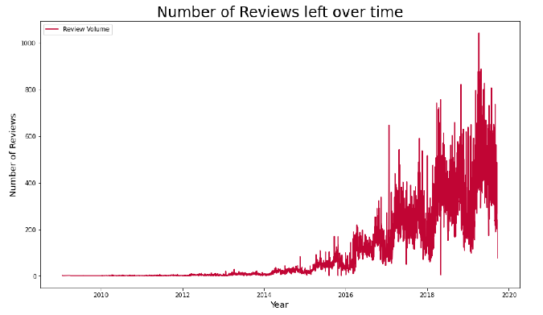

From the above chart, it is well observed that the number of comments left steady increased over
the years. This can be explained with the increase popularity of Airbnb over the past decade
and the increase in the number of the listing posting in Washington DC. Though, we can observe
fluctuations of the number of reviews left during a single year. Taking a sample within a year - 2017, we can observe reviews spikes and drops throughout the
years. For example, Feb 2017 was an exceptionally warm February which cause a strong spike in
tourist visiting DC. Another example are events such as April - May 2017 - Cherry Blossom period
in DC.

#### Sentiment Analysis

As there is no pre-classification of reviews, we use transfer learning of a pre-trained model (VADER (Valence Aware Dictionary and sentiment Reasoner)) which is tuned to sentiments expressed in social media to label the reviews left at Airbnb. The model generates negative, positive, and neutral score for each review and create a compound score where it classifies if a review is positive or negative. 

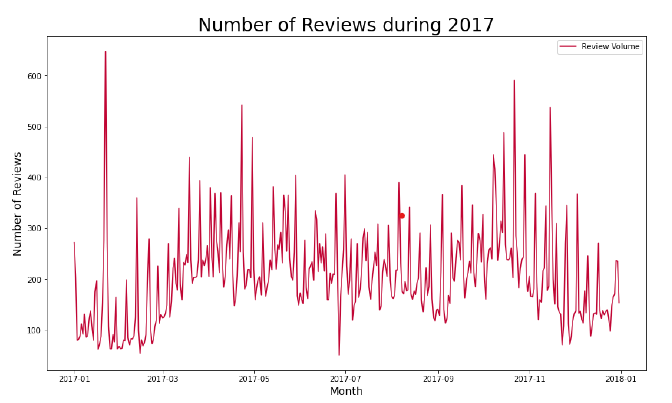

From the above, we can observe that majority of the reviews are perceived as neutral reviews with
slight positivity, and not a lot of negative reviews. Thus, this shows that most reviews left are positive things that customers like about their stays though it does not reveal too much about what. Thus, we conduct topic modeling to see what are the common themes of these positive/neutral reviews. 

#### Topic modeling through LDA

To better understanding what people interested, we conduct Topic modeling with LDA to cluster word groups and similar expressions that best characterize the reviews. After removing punctuations and stop words, we covert tokenize and normalize each reviews (document) and create document term matrix. Then applying LDA to find topics.

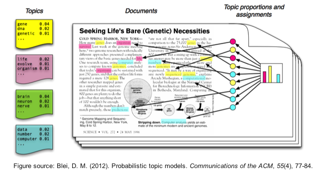

To determine the optimal number of topics, we calculate the coherence score (which assess the quality of the learn topics) and conduct a grid search by repeating the process for various number of topics.

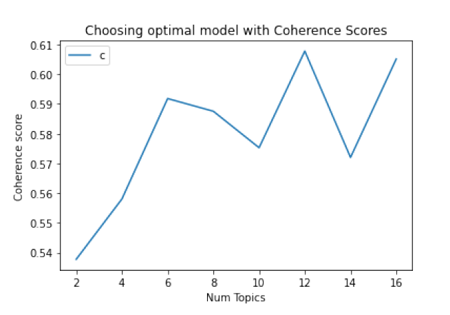

As the coherence score does not linear increase, we choose the value that elbow value before the high fluctuation of coherence score (6 topics). The results are these following six cluster of words.

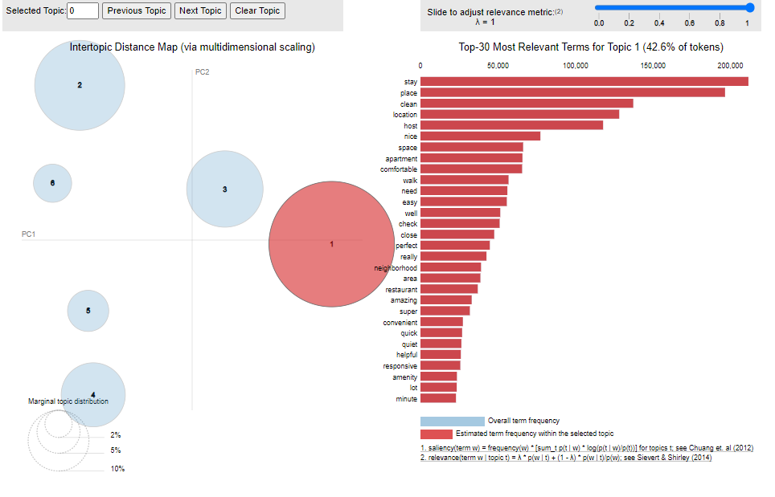

which we then look through the words and assign a topic to these six clusters of words respectively:

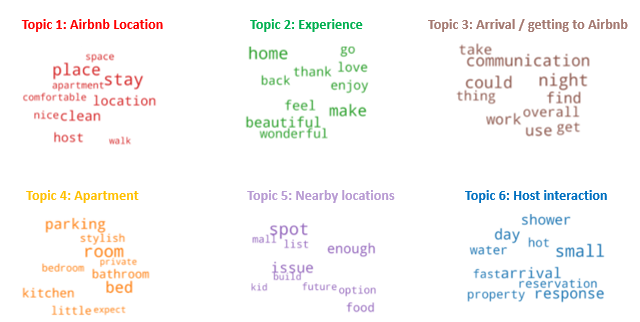

From the Topic modelling, we find that user talks a lot about Airbnb location, and the experience during the stay. This is further reinforced with the description of the listing with location of the Airbnb / nearby sightseeing locations as the most common words used. 

### Listing

To better understand the listing price of an Airbnb listing, we take a closer look at the listing details.
After cleaning the dataset there are 9189 listing with 12 numerical variables, 7 categorical, 1 Date and 1 text after cleaning the dataset.
Taking a deeper look at the variables, it is interesting to note the following observations:

• There are 6076 distinct host with 49% of the host having only one listing and 14.7% having two listing. Interestingly though there is one host with 1795 listing (host name: Zeus)
• 45% of the listing has property type Apartment with entire apartment room type (71%) to be most common for listing.
• distribution of listing across the neighborhood are quite even with Columbia Heights and Union station (~10%)

Looking the correlation of Price to other variable, we can note that:

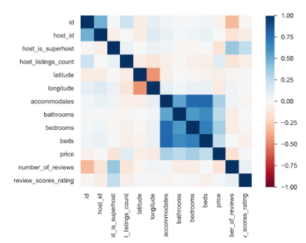

• Price is positively correlated to accommodates, bathrooms, beds, bedrooms (which are related
to size), number of listing per host (though maybe skewed by Zeus)
• more interestingly Price is negatively correlated to is whether host is super host. Which may
indicate that super host are more realistic at pricing their listing.

we can observe that majority of the listing has price in range between $0 to $600 and only around 400 listing that has price per night greater than $600 dollars. Taking a closer look at these high price listing, majority are large houses/mansions that are for rent and most of them do not have reviews left on them. Thus, we can treat them as outlier and do not represent the general majority of the listing in Washington DC. 

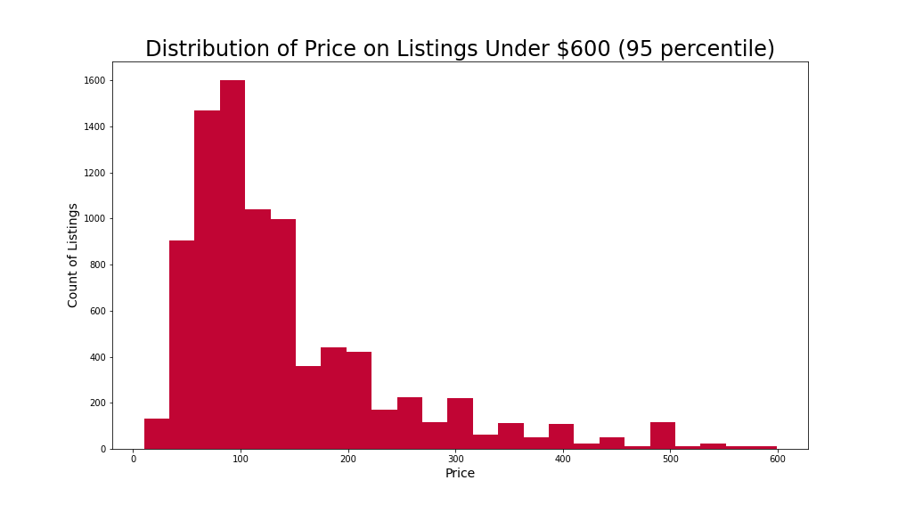

#### Location

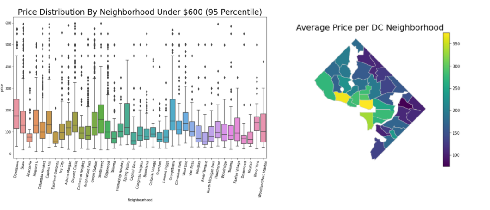

From the boxplot and the map, we can observe that most expensive neighborhood on average for Airbnb is Georgetown and Southwest neighborhood followed by Capital hill area, while the least expensive neighborhood on average is Mayfair. From the above maps and charts, we can see that there seems to be a general trend that closer the listing
is to National Mall, the more expensive the average listing price. 

#### Room and Property Type

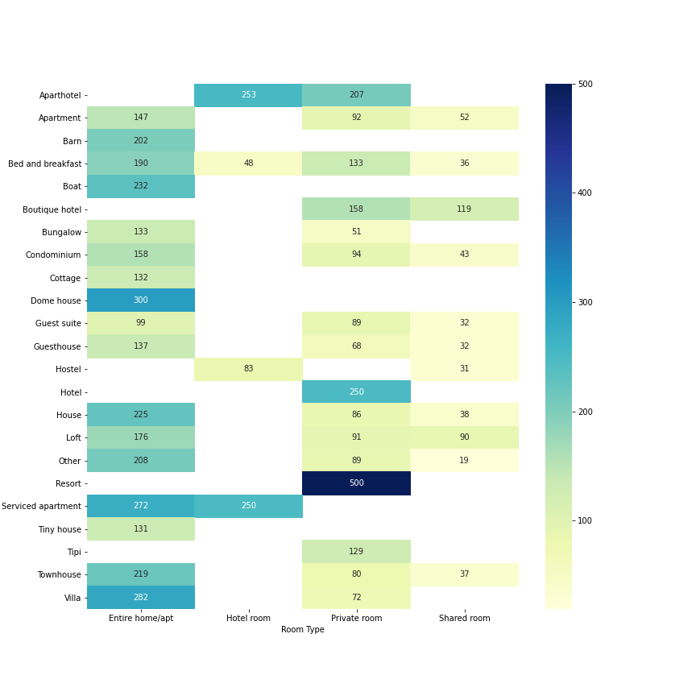

The above heatmap all the listing price broken down by property type and room type. This chart
gives us a much better understanding of the price breakdown in DC based on property type and
room type. It can be observed that private room in resort type is the most expensive. For property type that Entire home/aprt for those that have the option is the most expensive as expected.

#### Summary word cloud

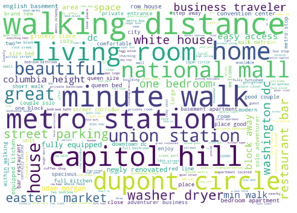

From the above word cloud, we can see that in summary section, most host owners that has a
higher price list mentions most about its location relative to sightseeing spots (e.g. National Mall,
Capital Hill), transport (metro station) then followed by amenities it provides. This thus further
emphasis that location, location and location matter strongly when determining the price per
night for Airbnb listings in Washington DC.

From the EDA, we can observe various factor affect the listing price per night, but the most important factors are location and size of the listing.

## Implications and Future Improvements

The implication of topic modeling and understanding of the pricing model, is that we can create a model to create a recommendation of what a listing price should be from it's listing details and from our topic modeling to create listing page that would attract customer to stay at. Though currently with a simple XGboost model, we are arriving at a pretty subpar accuracy thus for future iterations we can perhaps improve the recommendation model by using different models and use a ensemble model learning or conduct pca to reduce the number of variables. 

